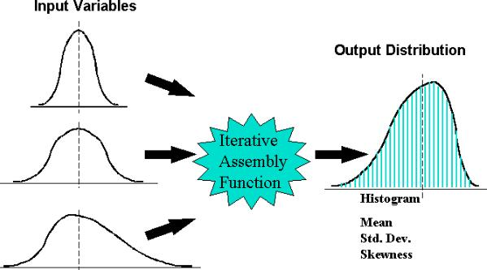

# Monte Carlo for Finance

Computational simulation that rely on repeated random sampling to obtain results.

# Monte Carlo Method

## How we do this?

It relies on the assumption that many random samples mimic patterns in the total population.



## Formula

Assuming daily returns are distributed by a Multivariate Normal Distribution.

$$
R_t \sim MVN(\mu,\sum)
$$


**Cholesky Decomposition** is used to determine Lower Triangular Matrix 

$$
L \in LL’=\sum \\ R_t= \mu+LZ_t \\ Z_t \sim N(0,I)
$$

Where Z_t are the samples from a normal distribution (Ι represents the Identity matrix).

## Implement the Monte Carlo Method

Import data

```python
import pandas as pd
import numpy as np
import matplotlib.pyplot as plt
import datetime as dt
from pandas_datareader import data as pdr
import yfinance as yf
yf.pdr_override()

# import data
def get_data(stocks, start, end):
    stockData = pdr.get_data_yahoo(stocks, start, end)
    stockData = stockData['Close'] # close price
    returns = stockData.pct_change() # percent change
    meanReturns = returns.mean() # mean returns
    covMatrix = returns.cov() # covariance matrix
    return meanReturns, covMatrix
stockList = ['^GSPC', '^TNX', 'BTC-USD', '0050.TW', '2330.TW', 'MSFT']
endDate = dt.datetime.now()
startDate = endDate - dt.timedelta(days=300) # this time range is important that make the covariance matrix different 
meanReturns, covMatrix = get_data(stockList, startDate, endDate)
weights = np.random.random(len(meanReturns)) # get random between at [0,1)
weights /= np.sum(weights) # weights matrix equal to 1. Note: it does not optimising the weights.
# print(weights) # check if the weights matrix is right
```

[All you need to know about yfinance : Yahoo! Finance Library](https://medium.com/nerd-for-tech/all-you-need-to-know-about-yfinance-yahoo-finance-library-fa4c6e48f08e)

The Monte Carlo method

```python
# Monte Carlo Method
mc_sims = 400 # number of simulations
T = 100 #timeframe in days
meanM = np.full(shape=(T, len(weights)), fill_value=meanReturns) # means matrix
meanM = meanM.T # takes transpose in order to do computation
portfolio_sims = np.full(shape=(T, mc_sims), fill_value=0.0) # portfolio simulations matrix
initialPortfolio = 10000 # initial portfolio value
for m in range(0, mc_sims): # MC loops
    Z = np.random.normal(size=(T, len(weights)))# uncorrelated RV's
    L = np.linalg.cholesky(covMatrix) # Cholesky decomposition to Lower Triangular Matrix
    dailyReturns = meanM + np.inner(L, Z) # Correlated daily returns for individual stocks
    portfolio_sims[:,m] = np.cumprod(np.inner(weights, dailyReturns.T)+1)*initialPortfolio # what the portfolio each day and take the accumulated product of daily returns
plt.plot(portfolio_sims)
plt.ylabel('Portfolio Value ($)')
plt.xlabel('Days')
plt.title('MC simulation of a portfolio')
plt.show()
```

Plot show


[Simulated Stock Portolio](https://quantpy.com.au/python-for-finance/simulated-stock-portolio/)

# VaR & CVaR with Monte Carlo

## VaR & CVaR


## ****Implement Value at Risk & Conditional Value at Risk****

```python
def mcVaR(returns, alpha=5):
    """ Input: pandas series of returns
        Output: percentile on return distribution to a given confidence level alpha
    """
    if isinstance(returns, pd.Series): # isinstance() function returns True if the specified object is of the specified type, otherwise False
        return np.percentile(returns, alpha)
    else:
        raise TypeError("Expected a pandas data series.")
def mcCVaR(returns, alpha=5):
    """ Input: pandas series of returns
        Output: CVaR or Expected Shortfall to a given confidence level alpha
    """
    if isinstance(returns, pd.Series):
        belowVaR = returns <= mcVaR(returns, alpha=alpha)
        return returns[belowVaR].mean()
    else:
        raise TypeError("Expected a pandas data series.")
```

```python
portResults = pd.Series(portfolio_sims[-1,:])
VaR = initialPortfolio - mcVaR(portResults, alpha=5)
CVaR = initialPortfolio - mcCVaR(portResults, alpha=5)
print('VaR ${}'.format(round(VaR,2)))
print('CVaR ${}'.format(round(CVaR,2)))
```

Results: 

VaR $917.63
CVaR $1353.38


[Value at Risk (VaR) and Conditional VaR (CVaR)](https://quantpy.com.au/risk-management/value-at-risk-var-and-conditional-var-cvar/)

# ****Efficient Frontier using MC simulation****

## **M**odern Portfolio Theory

The theory behind MPT is based on two key equations: the expected return equation and the risk equation.

$$
E(R_p) = w_0E(R_0)+w_1E(R_1)+...+w_nE(R_n)
$$

Where:

- $E(R_p)$ is the expected return of the portfolio
- $w_0, w_1, w_2, …, w_n$ are the weights assigned to each asset in the portfolio
- $E(R_1), E(R_2), …, E(R_n)$ are the expected returns of each asset in the portfolio
- $R_0$ is constant and is the return of the cash asset which is known as **risk-free asset.**
    
    
    


Where:

- $Var(R_p)$ is the variance (risk) of the portfolio return.
- $w_0, w_1, w_2, …, w_n$ are the weights assigned to each asset in the portfolio.
- $Cov(R_i, R_j)$ are the covariance between returns of each two assets (including itself i.e. variance of the asset returns) in the portfolio.

this could be re-written in matrix form such as:


## ****Optimization Problem****

1. maximize expected return while obtaining a certain level of risk:


1. minimize risk (variance) while obtaining a certain level of return.


1. instead of Maximizing the return, we try to maximize the Sharpe ratio (risk-adjusted return) which is defined as:


## Why MC?

1. using the Monte Carlo Method in MPT is that it can handle cases where the problem is non-linear or the portfolio contains a large number of assets.
2. the Monte Carlo Method can also be used to estimate the optimal solution in cases where the expected return and risk of the assets are uncertain or unknown.
3. it’s not guaranteed to get the global optima, but it may give a good approximation.

## Implement Efficient Frontier

```python
import numpy as np
import pandas as pd
import matplotlib.pyplot as plt
import matplotlib as mpl
import seaborn as sns

def calc_returns(price_data, resample=None, ret_type="arithmetic"):
    """
    Parameters
        price_data: price timeseries pd.DataFrame object.
        resample:   DateOffset, Timedelta or str. `None` for not resampling. Default: None
                    More on Dateoffsets : https://pandas.pydata.org/pandas-docs/stable/user_guide/timeseries.html#dateoffset-objects
        ret_type:   return calculation type. \"arithmatic\" or \"log\"

    Returns:
        returns timeseries pd.DataFrame object
    """
    if ret_type=="arithmetic":
        ret = price_data.pct_change().dropna()
    elif ret_type=="log":
        ret = np.log(price_data/price_data.shift()).dropna()
    else:
        raise ValueError("ret_type: return calculation type is not valid. use \"arithmatic\" or \"log\"")

    if resample != None:
        if ret_type=="arithmetic":
            ret = ret.resample(resample).apply(lambda df: (df+1).cumprod(axis=0).iloc[-1]) - 1
        elif ret_type=="log":
            ret = ret.resample(resample).apply(lambda df: df.sum(axis=0))
    return(ret)
```

```python
def calc_returns_stats(returns):
    """
    Parameters
        returns: returns timeseries pd.DataFrame object

    Returns:
        mean_returns: Avereage of returns
        cov_matrix: returns Covariance matrix
    """
    mean_returns = returns.mean()
    cov_matrix = returns.cov()
    return(mean_returns, cov_matrix)

def portfolio(weights, mean_returns, cov_matrix):

    portfolio_return = np.dot(weights.reshape(1,-1), mean_returns.values.reshape(-1,1))
    portfolio_var = np.dot(np.dot(weights.reshape(1,-1), cov_matrix.values), weights.reshape(-1,1))
    portfolio_std = np.sqrt(portfolio_var)

    return(np.squeeze(portfolio_return),np.squeeze(portfolio_var),np.squeeze(portfolio_std))
```

### ****Monte Carlo Simulation****

```python
num_iter = 500000

porfolio_var_list = []
porfolio_ret_list = []
w_list =[]

max_sharpe = 0
max_sharpe_var = None
max_sharpe_ret = None
max_sharpe_w = None

daily_ret = calc_returns(adj_close, resample=None, ret_type="log")
mean_returns, cov_matrix = calc_returns_stats(daily_ret)

for i in range(1,num_iter+1):
    rand_weights = np.random.random(len(symbols))
    rand_weights = rand_weights/np.sum(rand_weights)

    porfolio_ret, porfolio_var, portfolio_std = portfolio(rand_weights, mean_returns, cov_matrix)

    # Anuualizing
    porfolio_ret = porfolio_ret * 252
    porfolio_var = porfolio_var * 252
    portfolio_std = portfolio_std * (252**0.5)

    sharpe = (porfolio_ret/(porfolio_var**0.5)).item()
    if sharpe > max_sharpe:
        max_sharpe = sharpe
        max_sharpe_var = porfolio_var.item()
        max_sharpe_ret = porfolio_ret.item()
        max_sharpe_w = rand_weights

    porfolio_var_list.append(porfolio_var)
    porfolio_ret_list.append(porfolio_ret)
    w_list.append(rand_weights)
    if ((i/num_iter)*100)%10 == 0:
        print(f'%{round((i/num_iter)*100)}...',end='')
```

### ****Using SciPy ‘Optimize’ Module****

```python
# functions to minimize
def neg_sharpe_ratio(weights, mean_returns, cov_matrix, risk_free_rate=0):
    portfolio_return, portfolio_var, portfolio_std = portfolio(weights, mean_returns, cov_matrix)
    sr = ((portfolio_return - risk_free_rate)/portfolio_std) * (252**0.5) # annualized
    return(-sr)

def portfolio_variance(weights, mean_returns, cov_matrix):
    portfolio_return, portfolio_var, portfolio_std = portfolio(weights, mean_returns, cov_matrix)
    return(portfolio_var*252)
```

```python
import scipy.optimize as opt

def optimize_sharpe_ratio(mean_returns, cov_matrix, risk_free_rate=0, w_bounds=(0,1)):
    "This function finds the portfolio weights which minimize the negative sharpe ratio"

    init_guess = np.array([1/len(mean_returns) for _ in range(len(mean_returns))])
    args = (mean_returns, cov_matrix, risk_free_rate)
    constraints = ({'type': 'eq', 'fun': lambda x: np.sum(x) - 1})
    result = opt.minimize(fun=neg_sharpe_ratio,
                          x0=init_guess,
                          args=args,
                          method='SLSQP',
                          bounds=tuple(w_bounds for _ in range(len(mean_returns))),
                          constraints=constraints,
                          )
    
    if result['success']:
        print(result['message'])
        opt_sharpe = - result['fun']
        opt_weights = result['x']
        opt_return, opt_variance, opt_std = portfolio(opt_weights, mean_returns, cov_matrix)
        return(opt_sharpe, opt_weights, opt_return.item()*252, opt_variance.item()*252, opt_std.item()*(252**0.5))
    else:
        print("Optimization was not succesfull!")
        print(result['message'])
        return(None)
```

```python
def minimize_portfolio_variance(mean_returns, cov_matrix, w_bounds=(0,1)):
    "This function finds the portfolio weights which minimize the portfolio volatility(variance)"

    init_guess = np.array([1/len(mean_returns) for _ in range(len(mean_returns))])
    args = (mean_returns, cov_matrix)
    constraints = ({'type': 'eq', 'fun': lambda x: np.sum(x) - 1})
    result = opt.minimize(fun=portfolio_variance,
                          x0=init_guess,
                          args=args,
                          method='SLSQP',
                          bounds=tuple(w_bounds for _ in range(len(mean_returns))),
                          constraints=constraints,
                          )
    
    if result['success']:
        print(result['message'])
        min_var = result['fun']
        min_var_weights = result['x']
        min_var_return, min_var_variance, min_var_std = portfolio(min_var_weights, mean_returns, cov_matrix)
        min_var_sharpe = (min_var_return/min_var_std)*(252**0.5)
        return(min_var_sharpe, min_var_weights, min_var_return.item()*252, min_var_variance.item()*252, min_var_std.item()*(252**0.5))
    else:
        print("Optimization operation was not succesfull!")
        print(result['message'])
        return(None)
```

```python
daily_ret = calc_returns(adj_close, resample=None, ret_type="log")
mean_returns, cov_matrix = calc_returns_stats(daily_ret)

# max sharpe portfolio
opt_sharpe, opt_weights, opt_return, opt_variance, opt_std = optimize_sharpe_ratio(
                                                                mean_returns,
                                                                cov_matrix,
                                                                risk_free_rate=0, w_bounds=(0,1))

# min variance portfolio
min_var_sharpe, min_var_weights, min_var_return, min_var_variance, min_var_std = minimize_portfolio_variance(
                                                                                      mean_returns,
                                                                                      cov_matrix, w_bounds=(0,1))
```

### ****Efficient Frontier****

```python
def calc_portfolio_return(weights, mean_returns, cov_matrix):
    portfolio_return, portfolio_var, portfolio_std = portfolio(weights, mean_returns, cov_matrix)
    return(portfolio_return.item()*252)

def efficient_portfolio(mean_returns, cov_matrix, target_return, w_bounds=(0,1)):
    """retuens the portfolio weights with minimum variance for a specific level of expected portfolio return"""    

    init_guess = np.array([1/len(mean_returns) for _ in range(len(mean_returns))])
    args = (mean_returns, cov_matrix)
    constraints = ({'type': 'eq', 'fun': lambda x: np.sum(x)-1},
                   {'type': 'eq', 'fun': lambda x: 252*np.squeeze(np.dot(x.reshape(1,-1),mean_returns.values.reshape(-1,1))) - target_return})
    result = opt.minimize(fun=portfolio_variance,
                          x0=init_guess,
                          args=args,
                          method='SLSQP',
                          bounds=tuple(w_bounds for _ in range(len(mean_returns))),
                          constraints=constraints,
                          )
    if not result['success']:
        print(result['message'])
    efficient_variance = result['fun']
    efficient_weights = result['x']
    efficient_return, _ , efficient_std = portfolio(efficient_weights, mean_returns, cov_matrix)
    efficient_sahrpe = (efficient_return/efficient_return)*(252**0.5)
    return(efficient_sahrpe, efficient_weights, efficient_return.item()*252, efficient_variance, efficient_std.item()*(252**0.5))
```

```python
#plotting the Efficient Frontier

daily_ret_var = daily_ret.var()
plt.figure(figsize=(10,8))

target_rets = np.arange(-0.12,0.15,0.002)
efficient_vars = np.array([efficient_portfolio(mean_returns,cov_matrix,target_return=x ,w_bounds=(0,1))[3] for x in target_rets])
plt.plot(efficient_vars,target_rets,marker='.',label="efficient frontier")

plt.scatter(porfolio_var_list,porfolio_ret_list,c=stat['Sharpe ratio'], alpha=0.8, cmap='plasma')
for sym in symbols:
    plt.scatter(daily_ret_var.loc[sym]*252, mean_returns.loc[sym]*252, marker='x', s=100, label=sym)

plt.scatter([opt_variance], [opt_return], marker='*', s=250, label='max sharpe p', c='blue')
plt.scatter(min_var_variance, min_var_return, marker='*', s=250, label='min vol p', c='green')

plt.xlabel('Variance')
plt.ylabel('Return')
plt.title('Efficient Frontier')
plt.legend(loc='upper right')

cmap = mpl.cm.plasma
norm = mpl.colors.Normalize(vmin=stat['Sharpe ratio'].min(), vmax=stat['Sharpe ratio'].max())
plt.colorbar(mpl.cm.ScalarMappable(norm=norm, cmap=cmap),label='Sharpe Ratio',);
```

### Result

```python
Portfolio with minimum volatility:

Annual Sharpe Ratio: -0.04 | Annual Return: % -1.09 | Annual Volatility: % 6.42

APA:    % 35.68
BKR:    % 1.5
DVN:    % 0.81
FANG:   % 0.07
ALL:    % 15.07
NWSA:   % 38.79
NWS:    % 8.08
Optimization terminated successfully
Portfolio with maximum sharpe ratio:

Annual Sharpe Ratio: 0.38 | Annual Return: % 12.39 | Annual Volatility: % 10.54

APA:    % 0.0
BKR:    % 0.0
DVN:    % 0.0
FANG:   % 0.0
ALL:    % 68.17
NWSA:   % 0.0
NWS:    % 31.83
Optimization terminated successfully
Efficient portfolio for 5% return level:

Annual Sharpe Ratio: 0.19 | Annual Return: % 5.0 | Annual Volatility: % 6.919

APA:    % 18.25
BKR:    % 0.0
DVN:    % 0.0
FANG:   % 0.0
ALL:    % 30.27
NWSA:   % 0.0
NWS:    % 51.49
```


## Implement Efficient Frontier

```python
import numpy as np
import pandas as pd
import matplotlib.pyplot as plt
import matplotlib as mpl
import seaborn as sns

def calc_returns(price_data, resample=None, ret_type="arithmetic"):
    """
    Parameters
        price_data: price timeseries pd.DataFrame object.
        resample:   DateOffset, Timedelta or str. `None` for not resampling. Default: None
                    More on Dateoffsets : https://pandas.pydata.org/pandas-docs/stable/user_guide/timeseries.html#dateoffset-objects
        ret_type:   return calculation type. \"arithmatic\" or \"log\"

    Returns:
        returns timeseries pd.DataFrame object
    """
    if ret_type=="arithmetic":
        ret = price_data.pct_change().dropna()
    elif ret_type=="log":
        ret = np.log(price_data/price_data.shift()).dropna()
    else:
        raise ValueError("ret_type: return calculation type is not valid. use \"arithmatic\" or \"log\"")

    if resample != None:
        if ret_type=="arithmetic":
            ret = ret.resample(resample).apply(lambda df: (df+1).cumprod(axis=0).iloc[-1]) - 1
        elif ret_type=="log":
            ret = ret.resample(resample).apply(lambda df: df.sum(axis=0))
    return(ret)
```

```python
def calc_returns_stats(returns):
    """
    Parameters
        returns: returns timeseries pd.DataFrame object

    Returns:
        mean_returns: Avereage of returns
        cov_matrix: returns Covariance matrix
    """
    mean_returns = returns.mean()
    cov_matrix = returns.cov()
    return(mean_returns, cov_matrix)

def portfolio(weights, mean_returns, cov_matrix):

    portfolio_return = np.dot(weights.reshape(1,-1), mean_returns.values.reshape(-1,1))
    portfolio_var = np.dot(np.dot(weights.reshape(1,-1), cov_matrix.values), weights.reshape(-1,1))
    portfolio_std = np.sqrt(portfolio_var)

    return(np.squeeze(portfolio_return),np.squeeze(portfolio_var),np.squeeze(portfolio_std))
```

### ****Monte Carlo Simulation****

```python
num_iter = 500000

porfolio_var_list = []
porfolio_ret_list = []
w_list =[]

max_sharpe = 0
max_sharpe_var = None
max_sharpe_ret = None
max_sharpe_w = None

daily_ret = calc_returns(adj_close, resample=None, ret_type="log")
mean_returns, cov_matrix = calc_returns_stats(daily_ret)

for i in range(1,num_iter+1):
    rand_weights = np.random.random(len(symbols))
    rand_weights = rand_weights/np.sum(rand_weights)

    porfolio_ret, porfolio_var, portfolio_std = portfolio(rand_weights, mean_returns, cov_matrix)

    # Anuualizing
    porfolio_ret = porfolio_ret * 252
    porfolio_var = porfolio_var * 252
    portfolio_std = portfolio_std * (252**0.5)

    sharpe = (porfolio_ret/(porfolio_var**0.5)).item()
    if sharpe > max_sharpe:
        max_sharpe = sharpe
        max_sharpe_var = porfolio_var.item()
        max_sharpe_ret = porfolio_ret.item()
        max_sharpe_w = rand_weights

    porfolio_var_list.append(porfolio_var)
    porfolio_ret_list.append(porfolio_ret)
    w_list.append(rand_weights)
    if ((i/num_iter)*100)%10 == 0:
        print(f'%{round((i/num_iter)*100)}...',end='')
```

### ****Using SciPy ‘Optimize’ Module****

```python
# functions to minimize
def neg_sharpe_ratio(weights, mean_returns, cov_matrix, risk_free_rate=0):
    portfolio_return, portfolio_var, portfolio_std = portfolio(weights, mean_returns, cov_matrix)
    sr = ((portfolio_return - risk_free_rate)/portfolio_std) * (252**0.5) # annualized
    return(-sr)

def portfolio_variance(weights, mean_returns, cov_matrix):
    portfolio_return, portfolio_var, portfolio_std = portfolio(weights, mean_returns, cov_matrix)
    return(portfolio_var*252)
```

```python
import scipy.optimize as opt

def optimize_sharpe_ratio(mean_returns, cov_matrix, risk_free_rate=0, w_bounds=(0,1)):
    "This function finds the portfolio weights which minimize the negative sharpe ratio"

    init_guess = np.array([1/len(mean_returns) for _ in range(len(mean_returns))])
    args = (mean_returns, cov_matrix, risk_free_rate)
    constraints = ({'type': 'eq', 'fun': lambda x: np.sum(x) - 1})
    result = opt.minimize(fun=neg_sharpe_ratio,
                          x0=init_guess,
                          args=args,
                          method='SLSQP',
                          bounds=tuple(w_bounds for _ in range(len(mean_returns))),
                          constraints=constraints,
                          )
    
    if result['success']:
        print(result['message'])
        opt_sharpe = - result['fun']
        opt_weights = result['x']
        opt_return, opt_variance, opt_std = portfolio(opt_weights, mean_returns, cov_matrix)
        return(opt_sharpe, opt_weights, opt_return.item()*252, opt_variance.item()*252, opt_std.item()*(252**0.5))
    else:
        print("Optimization was not succesfull!")
        print(result['message'])
        return(None)
```

```python
def minimize_portfolio_variance(mean_returns, cov_matrix, w_bounds=(0,1)):
    "This function finds the portfolio weights which minimize the portfolio volatility(variance)"

    init_guess = np.array([1/len(mean_returns) for _ in range(len(mean_returns))])
    args = (mean_returns, cov_matrix)
    constraints = ({'type': 'eq', 'fun': lambda x: np.sum(x) - 1})
    result = opt.minimize(fun=portfolio_variance,
                          x0=init_guess,
                          args=args,
                          method='SLSQP',
                          bounds=tuple(w_bounds for _ in range(len(mean_returns))),
                          constraints=constraints,
                          )
    
    if result['success']:
        print(result['message'])
        min_var = result['fun']
        min_var_weights = result['x']
        min_var_return, min_var_variance, min_var_std = portfolio(min_var_weights, mean_returns, cov_matrix)
        min_var_sharpe = (min_var_return/min_var_std)*(252**0.5)
        return(min_var_sharpe, min_var_weights, min_var_return.item()*252, min_var_variance.item()*252, min_var_std.item()*(252**0.5))
    else:
        print("Optimization operation was not succesfull!")
        print(result['message'])
        return(None)
```

```python
daily_ret = calc_returns(adj_close, resample=None, ret_type="log")
mean_returns, cov_matrix = calc_returns_stats(daily_ret)

# max sharpe portfolio
opt_sharpe, opt_weights, opt_return, opt_variance, opt_std = optimize_sharpe_ratio(
                                                                mean_returns,
                                                                cov_matrix,
                                                                risk_free_rate=0, w_bounds=(0,1))

# min variance portfolio
min_var_sharpe, min_var_weights, min_var_return, min_var_variance, min_var_std = minimize_portfolio_variance(
                                                                                      mean_returns,
                                                                                      cov_matrix, w_bounds=(0,1))
```

### ****Efficient Frontier****

```python
def calc_portfolio_return(weights, mean_returns, cov_matrix):
    portfolio_return, portfolio_var, portfolio_std = portfolio(weights, mean_returns, cov_matrix)
    return(portfolio_return.item()*252)

def efficient_portfolio(mean_returns, cov_matrix, target_return, w_bounds=(0,1)):
    """retuens the portfolio weights with minimum variance for a specific level of expected portfolio return"""    

    init_guess = np.array([1/len(mean_returns) for _ in range(len(mean_returns))])
    args = (mean_returns, cov_matrix)
    constraints = ({'type': 'eq', 'fun': lambda x: np.sum(x)-1},
                   {'type': 'eq', 'fun': lambda x: 252*np.squeeze(np.dot(x.reshape(1,-1),mean_returns.values.reshape(-1,1))) - target_return})
    result = opt.minimize(fun=portfolio_variance,
                          x0=init_guess,
                          args=args,
                          method='SLSQP',
                          bounds=tuple(w_bounds for _ in range(len(mean_returns))),
                          constraints=constraints,
                          )
    if not result['success']:
        print(result['message'])
    efficient_variance = result['fun']
    efficient_weights = result['x']
    efficient_return, _ , efficient_std = portfolio(efficient_weights, mean_returns, cov_matrix)
    efficient_sahrpe = (efficient_return/efficient_return)*(252**0.5)
    return(efficient_sahrpe, efficient_weights, efficient_return.item()*252, efficient_variance, efficient_std.item()*(252**0.5))
```

```python
#plotting the Efficient Frontier

daily_ret_var = daily_ret.var()
plt.figure(figsize=(10,8))

target_rets = np.arange(-0.12,0.15,0.002)
efficient_vars = np.array([efficient_portfolio(mean_returns,cov_matrix,target_return=x ,w_bounds=(0,1))[3] for x in target_rets])
plt.plot(efficient_vars,target_rets,marker='.',label="efficient frontier")

plt.scatter(porfolio_var_list,porfolio_ret_list,c=stat['Sharpe ratio'], alpha=0.8, cmap='plasma')
for sym in symbols:
    plt.scatter(daily_ret_var.loc[sym]*252, mean_returns.loc[sym]*252, marker='x', s=100, label=sym)

plt.scatter([opt_variance], [opt_return], marker='*', s=250, label='max sharpe p', c='blue')
plt.scatter(min_var_variance, min_var_return, marker='*', s=250, label='min vol p', c='green')

plt.xlabel('Variance')
plt.ylabel('Return')
plt.title('Efficient Frontier')
plt.legend(loc='upper right')

cmap = mpl.cm.plasma
norm = mpl.colors.Normalize(vmin=stat['Sharpe ratio'].min(), vmax=stat['Sharpe ratio'].max())
plt.colorbar(mpl.cm.ScalarMappable(norm=norm, cmap=cmap),label='Sharpe Ratio',);
```

### Result

```python
Portfolio with minimum volatility:

Annual Sharpe Ratio: -0.04 | Annual Return: % -1.09 | Annual Volatility: % 6.42

APA:    % 35.68
BKR:    % 1.5
DVN:    % 0.81
FANG:   % 0.07
ALL:    % 15.07
NWSA:   % 38.79
NWS:    % 8.08
Optimization terminated successfully
Portfolio with maximum sharpe ratio:

Annual Sharpe Ratio: 0.38 | Annual Return: % 12.39 | Annual Volatility: % 10.54

APA:    % 0.0
BKR:    % 0.0
DVN:    % 0.0
FANG:   % 0.0
ALL:    % 68.17
NWSA:   % 0.0
NWS:    % 31.83
Optimization terminated successfully
Efficient portfolio for 5% return level:

Annual Sharpe Ratio: 0.19 | Annual Return: % 5.0 | Annual Volatility: % 6.919

APA:    % 18.25
BKR:    % 0.0
DVN:    % 0.0
FANG:   % 0.0
ALL:    % 30.27
NWSA:   % 0.0
NWS:    % 51.49
```


## Compare with VaR &CVaR

Weights with minimum volatility: 

[0.3638, 0.0053, 0.093, 0.0092, 0.1252, 0.3236, 0.0799]
VaR $2144.49
CVaR $2630.93

Weights with random: 

[0.10737787 0.06922785 0.05354099 0.27555586 0.19999509 0.22151997
0.07278238]
VaR $2535.3
CVaR $3137.72

[Portfolio Optimization with Python: using SciPy Optimize & Monte Carlo Method](https://medium.datadriveninvestor.com/portfolio-optimization-with-python-using-scipy-optimize-monte-carlo-method-a5b4e89e0548)
